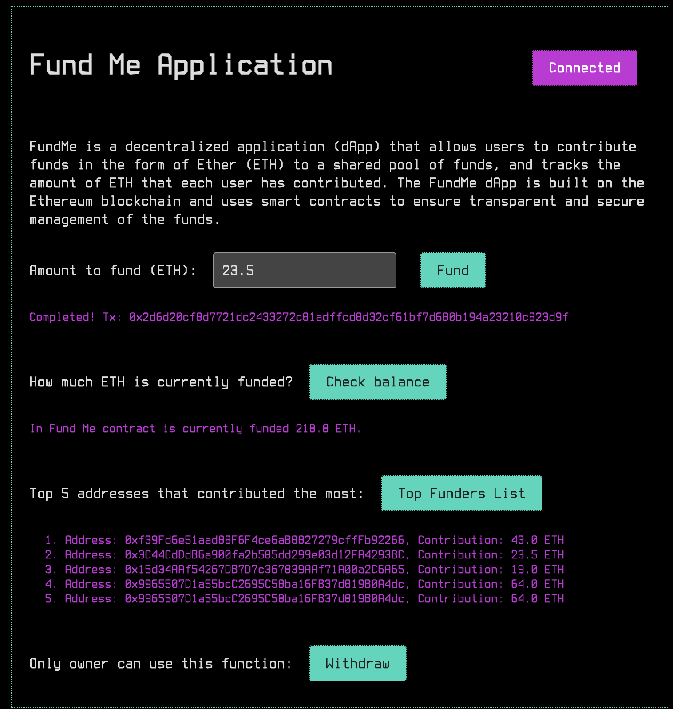

# Fund Me Hardhat Project

This repository contains the `frontend code` for the FundMe project. There is a separate repository for the basic `backend code`.

This contract was created using the `Hardhat` development framework and following a `32 hour YouTube course by Patrick Collins`.

It is a Solidity smart contract that enables users to contribute ETH to it. It tracks the contributions made by each user and includes a function to update a list of `top funders`, who are the users that have contributed the most amount of ETH. In order to contribute, users must contribute at least a minimum amount of USD, which is specified by the `MINIMUM_USD` constant. The contract uses a chainlink price feed contract to convert ETH values to USD values. Only the owner of the contract is able to call certain functions that are restricted by the onlyOwner modifier.

#

**Features**

-   Allows users to contribute ETH to the contract
-   Tracks the contributions made by each user
-   Includes a function to update a list of top funders
-   Requires a minimum amount of USD to be contributed
-   Uses a Chainlink `priceFeed` to convert ETH values to USD values
-   Restricts certain functions to only be called by the owner of the contract

#
